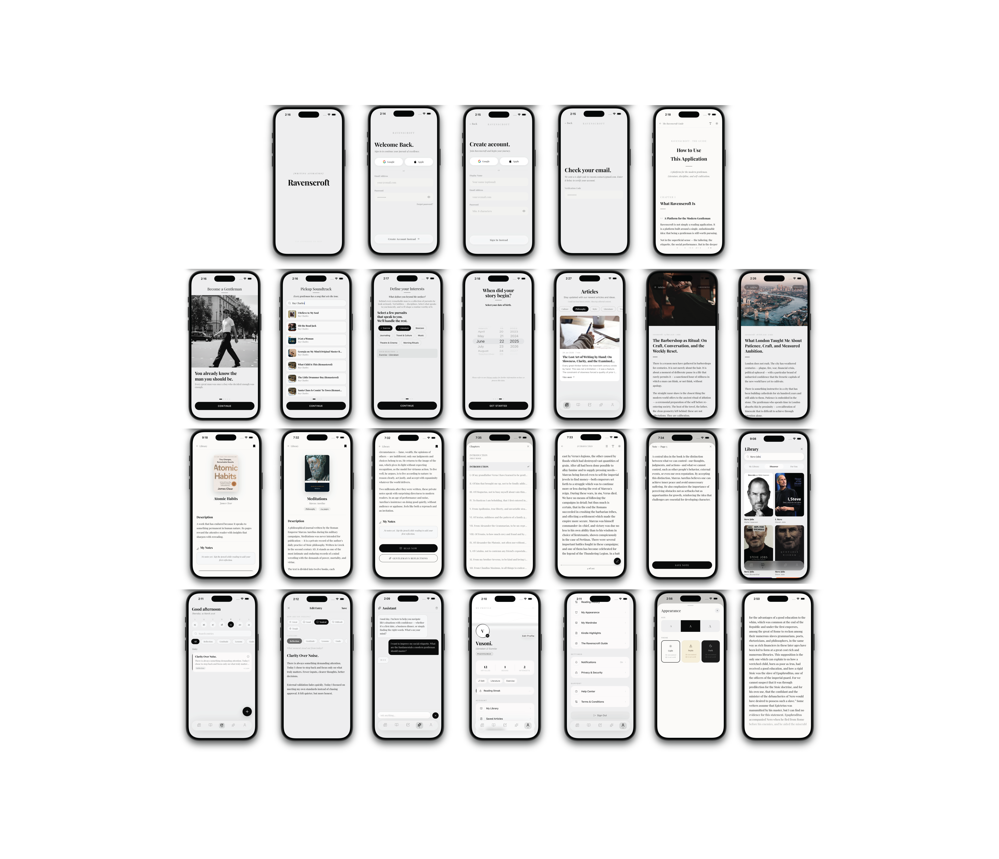

<div align="center">
  

  <h1>Ravenscroft</h1>
  <p><em>"You already know the man you should be."</em></p>

  <p>
    A premium self-mastery iOS app for modern gentlemen.<br/>
    Curated literature · AI guidance · Stoic philosophy · Editorial content · Personal journaling.
  </p>

  <p>
    
    
    
    
    
  </p>
</div>

---

## Overview


Ravenscroft is a private club for intellectual growth — combining hand-picked classic books (Project Gutenberg · Open Library · Google Books), a Claude-powered literary assistant, stoic philosophy, and editorial content into one cohesive, premium iOS experience.

**Target user**: Men 25–45 interested in self-improvement, classic literature, Stoicism, Marcus Aurelius, Ryan Holiday, Robert Greene.

**What makes it different**: The aesthetic. Every screen feels like holding a leather-bound book. No clutter, no gamification, no streaks — quiet, purposeful design.

---

## Screenshots

<div align="center">
  <table>
    <tr>
      <td></td>
      <td></td>
      <td></td>
      <td></td>
    </tr>
    <tr>
      <td align="center"><sub>Onboarding</sub></td>
      <td align="center"><sub>Library</sub></td>
      <td align="center"><sub>Reader</sub></td>
      <td align="center"><sub>AI Assistant</sub></td>
    </tr>
  </table>
</div>

---

## Stack

| Layer | Technology |
|---|---|
| Framework | Expo SDK 55 · React Native 0.83.2 · React 19.2 |
| Language | TypeScript (strict) |
| Routing | Expo Router v55 (file-based, typed routes) |
| Styling | NativeWind v4 + Tailwind CSS v3 |
| Animations | Reanimated v4.2 + react-native-worklets v0.7 |
| State | Zustand v5 + AsyncStorage v2 |
| Auth | Clerk (email/password, Google OAuth, Apple Sign In) |
| AI | Claude API — `claude-sonnet-4-6` (Anthropic) |
| Backend | Hono.js on Node — news aggregation + caching |
| Database | Supabase (PostgreSQL) |
| Typography | Playfair Display via @expo-google-fonts |
| Icons | lucide-react-native + react-native-svg |
| Glass effects | expo-blur (BlurView iOS) |
| Book data | Google Books API · Open Library API · Project Gutenberg |

---

## Features

- **5-screen onboarding** — typewriter animation, B&W editorial hero, soundtrack picker (iTunes API), interest chips, DOB
- **Books library** — search across Google Books + Open Library, add to personal library, track reading progress
- **In-app reader** — full text from Project Gutenberg, chapter navigation, S/M/L font sizes, light/sepia/dark themes, per-page annotations
- **AI Assistant** — Claude-powered literary + lifestyle mentor with scenario cards and full conversation history
- **Journal** — mood tracking, categories (Reflection, Gratitude, Lessons, Goals, Stoicism), calendar view, rich prompts
- **Editorial feed** — curated articles with full-text reader, category filters, hero images
- **Live news** — Hono backend aggregates NewsAPI + GNews, deduplicates via Jaccard similarity, scores by recency and source quality
- **Kindle import** — parse Clippings.txt, fuzzy-match to library books, deduplicate highlights
- **Appearance profile** — face shape, hair type, beard style, skin tone
- **Wardrobe** — outfit management
- **Glassmorphic UI** — BlurView tab bar, glass cards, spring animations throughout

---

## Architecture

```
┌─────────────────────────────────────────────┐
│              iOS App (Expo)                  │
│  Expo Router · NativeWind · Reanimated       │
│  Zustand stores (10) · AsyncStorage          │
└────────────┬──────────────┬─────────────────┘
             │              │
    ┌─────────▼──────┐  ┌───▼──────────────────┐
    │  Clerk Auth    │  │  Supabase (PostgreSQL) │
    │  Email/Google  │  │  Cloud sync (planned)  │
    │  Apple Sign In │  └──────────────────────-─┘
    └────────────────┘
             │
    ┌─────────▼────────────────────────────────┐
    │         Hono.js News Backend              │
    │  NewsAPI · GNews · Apify (optional)       │
    │  Jaccard dedup · Quality scorer           │
    │  In-memory cache (30 min TTL)             │
    └──────────────────────────────────────────┘
             │
    ┌─────────▼────────────────────────────────┐
    │           Claude API (Anthropic)          │
    │  claude-sonnet-4-6 · Literary assistant   │
    └──────────────────────────────────────────┘
```

---

## Getting Started

### Prerequisites

- Node.js 18+
- Expo CLI (`npm install -g expo-cli`)
- iOS Simulator (Xcode) or physical iPhone with Expo Go

### 1. Clone and install

```bash
git clone https://github.com/Vusoni/Gentlemen-AI-Application.git
cd Gentlemen-AI-Application
npm install
```

### 2. Set up environment variables

```bash
cp .env.example .env
```

Fill in your keys in `.env` — see the [Environment Variables](#environment-variables) section below.

### 3. Start the dev server

```bash
npx expo start --clear
```

Press `i` to open in iOS Simulator, or scan the QR code with Expo Go on your phone.

### 4. (Optional) Run the news backend

```bash
cd backend
npm install
cp .env.example .env   # fill in NEWSAPI_KEY and GNEWS_KEY
npm run dev            # starts on http://localhost:4242
```

---

## Environment Variables

### Mobile App (`.env`)

| Variable | Required | Description |
|---|---|---|
| `EXPO_PUBLIC_CLERK_PUBLISHABLE_KEY` | Yes | Clerk publishable key — [clerk.com](https://clerk.com) |
| `EXPO_PUBLIC_SUPABASE_URL` | Yes | Supabase project URL |
| `EXPO_PUBLIC_SUPABASE_ANON_KEY` | Yes | Supabase anon/public key |
| `EXPO_PUBLIC_GOOGLE_CLIENT_ID` | For Google auth | Google OAuth client ID |
| `EXPO_PUBLIC_GOOGLE_BOOKS_API_KEY` | Recommended | Enables book search without rate limits |
| `EXPO_PUBLIC_ANTHROPIC_API_KEY` | For AI assistant | Anthropic API key — [console.anthropic.com](https://console.anthropic.com) |
| `EXPO_PUBLIC_NEWS_API_BASE_URL` | For live news | URL of your deployed news backend |
| `EXPO_PUBLIC_APP_ENV` | No | `development` \| `staging` \| `production` |
| `CLERK_SECRET_KEY` | Server-side only | Never expose this in client code |
| `SUPABASE_SECRET_KEY` | Server-side only | Never expose this in client code |
| `GOOGLE_CLIENT_SECRET` | Server-side only | Never expose this in client code |

### News Backend (`backend/.env`)

| Variable | Required | Description |
|---|---|---|
| `NEWSAPI_KEY` | Yes | [newsapi.org](https://newsapi.org) — 100 req/day free |
| `GNEWS_KEY` | Yes | [gnews.io](https://gnews.io) — 100 req/day free |
| `PORT` | No | Default: `4242` |
| `CACHE_TTL_MINUTES` | No | Default: `30` |
| `APIFY_ENABLED` | No | `false` by default |

---

## Project Structure

```
├── app/
│   ├── _layout.tsx                   # Root layout — fonts, Clerk, providers
│   ├── index.tsx                     # Auth + onboarding gate
│   ├── (auth)/                       # Sign in · Sign up · Email verification
│   ├── (onboarding)/                 # 5-screen onboarding flow
│   └── (home)/
│       ├── (tabs)/                   # Feed · Books · Journal · Assistant · Profile
│       ├── book-detail.tsx
│       ├── book-reader.tsx           # Full in-app reader with chapter nav
│       ├── book-notes.tsx
│       ├── journal-entry.tsx
│       ├── appearance-setup.tsx
│       └── ...
│
├── components/
│   ├── GlassTabBar.tsx               # Frosted glass tab bar (BlurView)
│   ├── GlassCard.tsx                 # Reusable glass surface
│   └── ...
│
├── store/                            # 10 Zustand stores, all persisted
│   ├── authStore.ts
│   ├── booksStore.ts
│   ├── assistantStore.ts
│   ├── journalStore.ts
│   ├── newsStore.ts
│   └── ...
│
├── backend/                          # Hono.js news aggregation server
│   └── src/
│       ├── services/news/            # NewsAPI + GNews + Apify
│       ├── filters/                  # Dedup · Keyword filter · Quality scorer
│       ├── routes/                   # GET /api/articles · GET /health
│       └── storage/cache.ts          # In-memory TTL cache
│
├── constants/
│   ├── articles.ts                   # Editorial content
│   ├── bookSummaries.ts              # Curated book metadata
│   └── colors.ts                     # Design tokens
│
└── lib/
    ├── supabase.ts
    ├── kindleParser.ts               # Kindle Clippings.txt parser
    └── kindleMatcher.ts              # Fuzzy match highlights → library
```

---

## Design Tokens

| Token | Hex | Usage |
|---|---|---|
| `ivory` | `#EDEDED` | App background |
| `ink` | `#0A0A0A` | Primary text, CTAs |
| `charcoal` | `#1C1C1C` | Secondary text |
| `muted` | `#6B6B6B` | Captions, metadata |
| `border` | `#D4D4D4` | Dividers, hairlines |
| `surface` | `#F5F5F5` | Elevated surfaces |

---

## Scripts

```bash
# Mobile
npx expo start --clear       # Dev server (clear cache)
npx expo start --ios         # iOS Simulator
npx tsc --noEmit             # Type check
npx expo lint                # Lint
npx expo export --platform ios  # Production export

# Backend
npm run dev                  # Dev server with hot reload (tsx watch)
npm run build                # Compile TypeScript
npm start                    # Run compiled output
npm run typecheck            # Type check only
```

---

## Roadmap

- [ ] Supabase cloud sync for cross-device data
- [ ] Claude API proxy via Supabase Edge Function (move key server-side)
- [ ] EAS Build + TestFlight distribution
- [ ] Subscription paywall (RevenueCat)
- [ ] Push notifications — morning reading reminders
- [ ] App Store submission

---

<div align="center">
  <sub>Built with React Native · Expo · Claude AI · TypeScript</sub>
</div>
